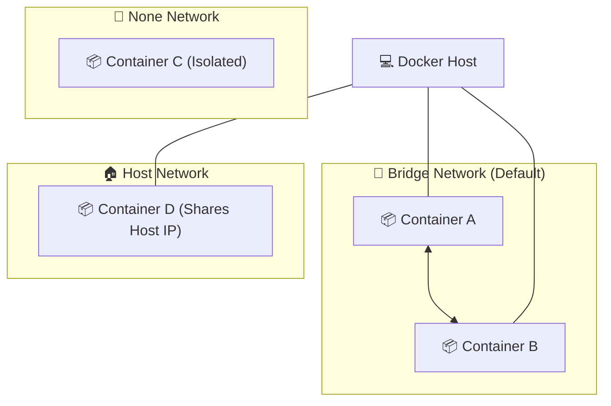

# 🐳 Docker Reference Guide

A comprehensive guide to essential Docker commands for managing containers and images efficiently.

---

## 🧱 Core Concepts

Before using commands, it's essential to understand the two main building blocks of Docker:

### 1. 🖼️ Docker Image
A **Docker Image** is a read-only template containing the instructions for creating a Docker container. Think of it as a **blueprint**, a **snapshot**, or a **class** in OOP.

- **📦 Layered Structure**: Application images are built on top of **Base Images**. You start with an OS layer and stack your application code and dependencies on top.
- **🐧 Linux Foundations**: Most containers are **Linux-based** because Linux is lightweight, open-source, and efficient for server environments.
- **🏔️ Example (Alpine)**: **Alpine Linux** is one of the most popular base images because it is incredibly small (approx. 5MB), ensuring fast downloads and minimal resource usage.

### 2. 📦 Docker Container
A **Docker Container** is a running instance of an image. It is a **live, isolated environment** where your application executes. It adds a thin writable layer on top of the read-only image.

- **📦 All-in-One Packaging**: Containers package the application code along with all its necessary dependencies, libraries, and configurations.
- **🚀 Portability**: Because everything is bundled together, containers are easily shared and moved across different environments (dev, staging, production) without "dependency hell."
- **⚡ Efficiency**: This consistency makes the entire development and deployment lifecycle significantly more streamlined and efficient.

---

### 💡 Image vs. Container Comparison

| Feature | Docker Image | Docker Container |
| :--- | :--- | :--- |
| **Analogy** | Blueprint / Class | Building / Object Instance |
| **State** | Static (Stored on disk) | Dynamic (Running in memory) |
| **Mutability** | Immutable (Read-only) | Mutable (Writable layer) |
| **Lifespan** | Persistent | Ephemeral (can be started/stopped/deleted) |

---

### 🏠 Where do they "Live"?

- **Docker Images** live in a **Registry** (like [Docker Hub](https://hub.docker.com)). You `pull` them from a registry to your local machine to use them.
- **Docker Containers** live and run on a **Docker Host**. This is your local computer or a cloud server where the **Docker Engine** is installed. Containers are isolated processes that share the host's OS kernel.

---

## 🛠️ Essential Commands

### 1. `docker version`
**Description**: Display the Docker version information, including client and server details. Use this to verify your installation and check compatibility.

**Example**:
```bash
$ docker version
Client:
 Version:           29.4.0
 API version:       1.54
 Go version:        go1.26.1
 Git commit:        9d7ad9f
 Built:             Tue Apr  7 08:39:39 2026
 OS/Arch:           windows/amd64
 Context:           desktop-linux

Server: Docker Desktop 4.69.0 (224084)
 Engine:
  Version:          29.4.0
  API version:      1.54 (minimum version 1.40)
  Go version:       go1.26.1
  Git commit:       daa0cb7
  Built:            Tue Apr  7 08:36:03 2026
  OS/Arch:          linux/amd64
  Experimental:     false
 containerd:
  Version:          v2.2.1
  GitCommit:        dea7da592f5d1d2b7755e3a161be07f43fad8f75
 runc:
  Version:          1.3.4
  GitCommit:        v1.3.4-0-gd6d73eb8
 docker-init:
  Version:          0.19.0
  GitCommit:        de40ad0
```

---

### 2. `docker images`
**Description**: List all locally stored Docker images. This command shows the repository name, tag, image ID, creation date, and size.

**Example**:
```bash
$ docker images
                                                                i Info →   U  In Use
IMAGE   ID             DISK USAGE   CONTENT SIZE   EXTRA
```

---

### 3. `docker pull`
**Description**: Download an image from a registry (typically Docker Hub) to your local machine.

**Syntax**:
```bash
docker pull [OPTIONS] NAME[:TAG|@DIGEST]
```

**Examples**:
```bash
# Pull the latest version of the official Nginx image
docker pull nginx:latest
```

```bash
$ docker pull redis
Using default tag: latest
latest: Pulling from library/redis
5435b2dcdf5c: Pull complete
edc4b8e535e8: Pull complete
0d8ecf679ede: Pull complete
e22d95bb4ed9: Pull complete
dbf833dfdfed: Pull complete
387e0421c8da: Pull complete
4f4fb700ef54: Pull complete
5eefc97b6afb: Download complete
048ce8724475: Download complete
Digest: sha256:1f073813b641755b70b0200da64131bbeeb4ec5b633ca67772229b49820caafa
Status: Downloaded newer image for redis:latest
docker.io/library/redis:latest

What's next:
    View a summary of image vulnerabilities and recommendations → docker scout quickview redis
```

---

### 4. `docker run`
**Description**: Create and start a container from an image. This command is the primary way to launch applications in Docker.

**Common Flags**:
- `-d`: Run container in the background (detached mode).
- `-p`: Publish a container's port(s) to the host (e.g., `8080:80`).
- `--name`: Assign a custom name to your container for easier management.
- `-it`: Interactive mode (interactive + TTY), useful for shell access.
- `--rm`: Automatically remove the container when it exits.
- `-e`: Set environment variables (e.g., `-e KEY=VALUE`).

**Examples**:
```bash
# Run an Nginx web server in the background on port 8080
docker run -d -p 8080:80 --name my-web-server nginx

# Run a Node.js container with a custom name
docker run --name my-node-app node

# Run a PostgreSQL database with an environment variable and port mapping
 docker run -d --name postgres_db -e POSTGRES_USER=pradipta -e POSTGRES_PASSWORD=password -e POSTGRES_DB=mydb -p 5432:5432 postgres:latest

# Run a mongo database with an environment variable with network and port mapping
  docker run -d --name mongo -p 27017:27017 -e MONGO_INITDB_ROOT_USERNAME=mongoadmin -e MONGO_INITDB_ROOT_PASSWORD=password --network mongo-network mongo:latest

# Run Node.js interactively with a custom name
docker run -it --name pradipta_node node

# Run a Redis container with a custom name
$ docker run --name pradipta_redis redis
Starting Redis Server
```

**What this command does**:
- **Finds the image**: Checks if the `node` image exists locally; if not, it pulls it from Docker Hub.
- **Creates the container**: Sets up a new container instance from the image.
- **Assigns a name**: Names the container `my-node-app` instead of using a random string.
- **Starts the process**: Executes the default entrypoint for the Node.js image.

---

### 5. `docker start`
**Description**: Start one or more stopped containers. This is used when you already have a container created (via `run` or `create`) but it is currently in a stopped state.

**Example**:
```bash
# Start a container by its name
docker start my-web-server

# Start a container by its ID
docker start 1a2b3c4d5e6f

# Start the Redis container and see its name as output
$ docker start pradipta_redis
pradipta_redis
```

---

## 💡 `docker run` vs `docker start`

Understanding the difference between these two is crucial for efficient container management:

| Feature | `docker run` | `docker start` |
| :--- | :--- | :--- |
| **Primary Action** | Creates a **NEW** container and starts it. | Restarts an **EXISTING** stopped container. |
| **Source** | Uses an **Image**. | Uses a **Container ID/Name**. |
| **Effect** | Every execution creates a fresh instance. | Resumes the state of a specific instance. |
| **Typical Use** | Initial deployment or testing. | Resuming work on a persistent container. |

> [!IMPORTANT]
> Use `docker run` when you want a new container. Use `docker start` when you want to bring an old container back to life.

### 💡 Execution Behavior
- **`docker run -d`**: Creates + starts a container in the **background**.
- **`docker start`**: Just starts an already created container. 
  - 👉 **Note**: By default, `docker start` always runs in the **background**.

---

> [!TIP]
> You can combine flags for more powerful queries, such as `docker ps -aq` to get only the IDs of all containers.

---

### 6. `docker attach`
**Description**: Attach your local standard input, output, and error streams to a running container. This allows you to view its output or interact with it in real-time.

> [!IMPORTANT]
> `docker attach` always takes you to the **primary command** (PID 1) of the container.

**Example**:
```bash
# Attach to a generic web server
docker attach my-web-server

# Attach to Redis and view shutdown logs after pressing Ctrl+C
$ docker attach pradipta_redis
1:signal-handler (1776784417) Received SIGINT scheduling shutdown...
1:M 21 Apr 2026 15:13:37.247 * User requested shutdown...
1:M 21 Apr 2026 15:13:37.250 * Saving the final RDB snapshot before exiting.
1:M 21 Apr 2026 15:13:37.258 * BGSAVE done, 0 keys saved, 0 keys skipped, 88 bytes written.
1:M 21 Apr 2026 15:13:37.271 * DB saved on disk
1:M 21 Apr 2026 15:13:37.271 # Redis is now ready to exit, bye bye...

got 3 SIGTERM/SIGINTs, forcefully exiting
```

> [!NOTE]
> When you attach to a process like Redis, the terminal may appear blank if the process isn't currently outputting anything. Pressing `Ctrl+C` will send a SIGINT signal, which typically stops the process and shuts down the container, as shown in the logs above.

> [!TIP]
> To detach from a container without stopping it, use the escape sequence `Ctrl+P`, `Ctrl+Q`.

---

### 7. `docker exec`
**Description**: Run a new command in a **running** container. This is most commonly used to open an interactive shell inside a container.

**Example**:
```bash
# Open an interactive bash shell inside a running container
docker exec -it my-web-server /bin/bash

# Run a single command (like 'ls') inside a container
docker exec my-web-server ls /etc/nginx

# Open the Redis CLI interactively inside a running Redis container
$ docker exec -it pradipta_redis redis-cli
127.0.0.1:6379> ping
PONG
127.0.0.1:6379>
```

---

### 8. `docker stop`
**Description**: Stop one or more running containers. This sends a SIGTERM signal to the container's primary process.

**Example**:
```bash
# Stop a container by its name
docker stop pradipta_redis

# Stop multiple containers
docker stop container1 container2

# Terminal output (confirms by echoing the name)
$ docker stop pradipta_redis
pradipta_redis
```

---

### 9. `docker rm`
**Description**: Remove one or more containers. The container must be stopped before it can be removed unless you use the `-f` (force) flag.

**Example**:
```bash
# Remove a stopped container
docker rm pradipta_redis

# Forcefully remove a running container
docker rm -f pradipta_redis

# Terminal output (confirms by echoing the name)
$ docker rm pradipta_redis
pradipta_redis
```

> [!CAUTION]
> If you try to remove a **running** container without the `-f` flag, Docker will throw an error:
> ```text
> Error response from daemon: cannot remove container "pradipta_redis": container is running: stop the container before removing or force remove
> ```

---

### 10. `docker ps`
**Description**: List running containers. Use the `-a` flag to see all containers (including stopped ones).

**Example**:
```bash
# List only running containers
docker ps

# List all containers (running and stopped)
docker ps -a

# View detailed information about running containers
$ docker ps
CONTAINER ID   IMAGE     COMMAND                  CREATED         STATUS         PORTS      NAMES
8698d0e806ac   redis     "docker-entrypoint.s…"   4 minutes ago   Up 2 minutes   6379/tcp   pradipta_redis
```

---

### 11. `docker logs`
**Description**: Fetch the logs of a container. This is essential for debugging applications running in detached mode or to see historical output.

**Options / Flags**:
- `-f`, `--follow`: Follow log output. Streams logs in real-time, similar to `tail -f`.
- `--tail`, `-n`: Number of lines to show from the end of the logs (e.g., `--tail 100` or `-n 100`). Default is "all".
- `-t`, `--timestamps`: Show timestamps in the log output. Helpful for chronological debugging.
- `--since`: Show logs since a specific timestamp or relative time (e.g., `--since 2026-04-22` or `--since 30m` for the last 30 minutes).
- `--until`: Show logs before a specific timestamp or relative time (e.g., `--until 1h` to see logs up to an hour ago).
- `--details`: Show extra details provided to logs, such as environment variables passed to the logger.

**Examples**:
```bash
# View the last 20 lines of logs for the Postgres database
docker logs --tail 20 postgres_db

# Follow the logs of a web server in real-time with timestamps
docker logs -f -t my-web-server

# View logs from the last 30 minutes
docker logs --since 30m my-node-app
```

---

### 12. `docker network ls`
**Description**: List all the networks that Docker is aware of on the host. This includes built-in networks like `bridge`, `host`, and `none`.

**Example**:
```bash
$ docker network ls
NETWORK ID     NAME      DRIVER    SCOPE
f9ca1d16e3dc   bridge    bridge    local
dac43f28d82b   host      host      local
65a0817ffe24   none      null      local
```

### 🧠 Understanding Network Columns

| Column | Description | Significance |
| :--- | :--- | :--- |
| **NAME** | The display name of the network. | Used to identify the network when connecting containers (e.g., `docker run --network <NAME>`). |
| **DRIVER** | The engine that manages the network. | Determines the networking behavior (Isolation, routing, multi-host connectivity). |
| **SCOPE** | The reach of the network. | `local` means it's confined to a single host; `swarm` means it spans multiple hosts. |

#### 🛠️ Common Network Drivers
- **bridge**: The default driver. Containers on the same bridge can talk to each other but are isolated from the host's physical network.
- **host**: Removes network isolation. The container uses the host's IP and ports directly.
- **none**: Complete isolation. The container has no network access.
- **overlay**: Connects multiple Docker daemons together, allowing containers to communicate across different physical machines.

### 📊 Network Isolation Visualization



---

### 13. `docker network create`
**Description**: Create a new network for your containers. By default, it creates a `bridge` network. Custom networks allow containers to communicate with each other using their container names as hostnames (Automatic DNS resolution).

**Example**:
```bash
# Create a custom bridge network named 'mongo-network'
$ docker network create mongo-network
f4cb73665d586d8ef26038bf80f65e01b8a7435918617a5b18231145aacb90e5
```

---

## 🐙 Docker Compose

**Docker Compose** is a tool for defining and running multi-container Docker applications. While the standard `docker run` command is great for starting single containers, modern applications usually consist of multiple interconnected services (e.g., a web frontend, a Node.js backend, a Postgres database).

Instead of running multiple long `docker run` commands and manually managing networks to link them, Docker Compose allows you to define your entire application stack in a single, readable YAML file (typically named `compose.yaml` or `docker-compose.yml`). 

### ✨ Key Benefits:
- **Single Command Operation**: Start, stop, and rebuild all your services together with a single command (e.g., `docker compose up` or `docker compose down`).
- **Declarative Configuration**: Your environments, ports, volumes, and dependencies are documented in a file, eliminating the need to memorize long CLI commands and making it easy to version control.
- **Automatic Networking**: By default, Compose sets up a dedicated, isolated network for your app. Containers can easily communicate with each other using their service names as hostnames.

### 📝 Example: Converting `docker run` to Compose

Here is an example of taking a complex `docker run` command and converting it into a clean `docker-compose.yml` file.

**The `docker run` Command**:
```bash
docker run -d --name mongo -p 27017:27017 -e MONGO_INITDB_ROOT_USERNAME=mongoadmin -e MONGO_INITDB_ROOT_PASSWORD=password --network mongo-network mongo:latest
```

**The Equivalent `docker-compose.yml`**:
```yaml
services:
  mongo:
    image: mongo:latest
    container_name: mongo # Replaces --name
    ports:
      - "27017:27017" # Replaces -p
    environment: # Replaces -e flags
      MONGO_INITDB_ROOT_USERNAME: mongoadmin
      MONGO_INITDB_ROOT_PASSWORD: password
    networks:
      - mongo-network # Replaces --network

networks:
  mongo-network:
    external: true # Assumes the network was created manually. Remove 'external: true' to let Compose create it automatically.
    driver: bridge # Explicitly sets the network type
```

**Understanding `driver: bridge`**:
- Setting `driver: bridge` explicitly tells Docker to use a bridge network (the default for container isolation on a single host). 
- While it is the default behavior when Compose creates a network, explicitly defining it makes your `compose.yaml` more readable and self-documenting. 
- *Note*: If you are using `external: true` (meaning the network was already created via `docker network create`), Compose relies on the existing network's configuration, so the `driver` field serves primarily as documentation here.


> [!TIP]
> To run this configuration in the background, simply execute: `docker compose up -d` in the same directory as the file.

### 🚀 Essential Compose Commands

#### `docker compose up`
**Description**: Builds, (re)creates, starts, and attaches to containers for all services defined in your Compose file.

**Common Flags / Options**:
- `-d`, `--detach`: **Detached mode.** Run containers in the background. This is the most common way to run compose in production or development.
- `-f`, `--file FILE`: **Specify an alternate file.** By default, Compose looks for `docker-compose.yml` or `compose.yaml`. You can specify a different file, like `docker-compose -f docker-compose.prod.yml up`.
- `--build`: **Force build.** Build images before starting containers. Essential if you've made changes to a `Dockerfile` that your compose file builds from.
- `--force-recreate`: **Recreate containers.** Forces the recreation of containers even if their configuration or image hasn't changed.
- `--remove-orphans`: **Clean up.** Removes containers for services not defined in the current Compose file (useful if you deleted a service from the file).
- `--no-deps`: **No dependencies.** Don't start linked services (e.g., start only the web app without the database it depends on).

**Examples**:
```bash
# 1. Run containers in the background (Detached mode)
docker compose up -d

# 2. Use a specific compose file (e.g., for production)
docker compose -f docker-compose.prod.yml up -d

# 3. Force build images before starting containers
docker compose up -d --build

# 4. Force recreate containers even if unchanged
docker compose up -d --force-recreate

# 5. Clean up old containers whose services were removed from the yaml file
docker compose up -d --remove-orphans

# 6. Start a specific service (e.g., 'web') without starting its dependencies
docker compose up -d --no-deps web

# 7. Combine flags: Use a specific file, force build, and remove orphans
docker compose -f docker-compose.prod.yml up -d --build --remove-orphans
```

#### `docker compose down`
**Description**: Stops containers and removes containers, networks, volumes, and images created by `up`. It is the cleanest way to gracefully tear down your application stack.

**Common Flags / Options**:
- `-v`, `--volumes`: **Remove volumes.** Remove named volumes declared in the `volumes` section of the Compose file and anonymous volumes attached to containers. *Extremely important if you want to completely wipe the database data and start fresh!*
- `--rmi type`: **Remove images.** Remove images used by services. Type must be one of:
    - `all`: Remove all images used by any service.
    - `local`: Remove only custom-built images that don't have a specific custom tag.
- `--remove-orphans`: **Clean up.** Remove containers for services not defined in the current Compose file.
- `-t`, `--timeout TIMEOUT`: **Set a timeout.** Specify a shutdown timeout in seconds (default is 10). Useful for applications that take a long time to run clean up scripts before exiting.

**Examples**:
```bash
# 1. Standard teardown (Stops containers and removes networks, but keeps data volumes and images)
docker compose down

# 2. Total Wipe: Remove everything including persistent database volumes (WARNING: Data will be lost!)
docker compose down -v

# 3. Teardown and remove all built or downloaded images
docker compose down --rmi all

# 4. Nuclear Option: Teardown, remove volumes, remove images, and remove orphans
docker compose down -v --rmi all --remove-orphans

# 5. Fast teardown (Wait only 2 seconds before forcefully killing containers)
docker compose down -t 2
```

---

## 📄 Understanding the Dockerfile

A **Dockerfile** is a plain text document containing a series of instructions that Docker uses to automatically build an image. 

Here is an example of a Dockerfile used for a Node.js (NestJS) application, broken down command by command:

```dockerfile
FROM node:24.15.0-alpine

# Set working directory
WORKDIR /app

# Copy package.json and yarn.lock
COPY package*.json ./
COPY yarn.lock ./

# Install dependencies (including dev dependencies needed for Nest CLI)
RUN yarn install --frozen-lockfile

# Copy the rest of the application code
COPY . .

# Expose application port
EXPOSE 3000

# Start the application in development mode with watch
CMD ["yarn", "start:dev"]
```

### 🧠 Dockerfile Instructions Explained

| Command | Description & Example |
| :--- | :--- |
| **`FROM`** | **Sets the Base Image.** Every Dockerfile must start with a `FROM` instruction. It specifies the underlying OS and environment. <br> *Example:* `FROM node:24.15.0-alpine` uses a lightweight Linux distribution (Alpine) containing Node.js version 24.15.0. |
| **`WORKDIR`** | **Sets the Working Directory.** Defines the default directory where all subsequent `COPY`, `RUN`, and `CMD` instructions will execute inside the container. <br> *Example:* `WORKDIR /app` means all following commands run inside the `/app` folder. |
| **`COPY`** | **Copies Files into the Container.** Moves files or directories from your local machine (host) into the container's filesystem. <br> *Example:* `COPY package*.json ./` copies `package.json` into the current working directory (`/app`). `COPY . .` copies everything from your local directory into the container. |
| **`RUN`** | **Executes Commands During Build.** Runs commands inside the container *while the image is being built*. This is typically used to install dependencies or packages. <br> *Example:* `RUN yarn install --frozen-lockfile` installs project dependencies cleanly into the image. |
| **`EXPOSE`** | **Documents the Port.** This does *not* actually publish the port to the host machine (you still need `-p` in `docker run`). It serves as documentation indicating which port the application inside the container will listen on. <br> *Example:* `EXPOSE 3000` means the Node application runs on port 3000. |
| **`CMD`** | **Sets the Default Command.** Specifies the command that will execute when the container is finally *started* (run). There can only be one `CMD` instruction in a Dockerfile. <br> *Example:* `CMD ["yarn", "start:dev"]` starts the application development server when the container boots up. |

### ⚖️ RUN vs CMD: The Crucial Difference

One of the most common points of confusion in Docker is understanding when to use `RUN` versus `CMD`.

| Feature | `RUN` | `CMD` |
| :--- | :--- | :--- |
| **When does it execute?** | During the **Build Phase** (when you run `docker build` or compose builds the image). | During the **Run Phase** (when the container actually boots up via `docker run` or `docker start`). |
| **What is its purpose?** | Modifies the image permanently (e.g., installing packages, creating files, compiling code). Each `RUN` creates a new layer in the image. | Defines the default process/program that the container will execute to keep it alive. |
| **How many can you have?**| You can have as many `RUN` instructions as you need. | You should only have **one** `CMD` instruction (if you have multiple, only the last one takes effect). |
| **Real-world Analogy** | Assembling the engine and putting gas in the car at the factory. | Turning the key in the ignition to start driving the car. |

---