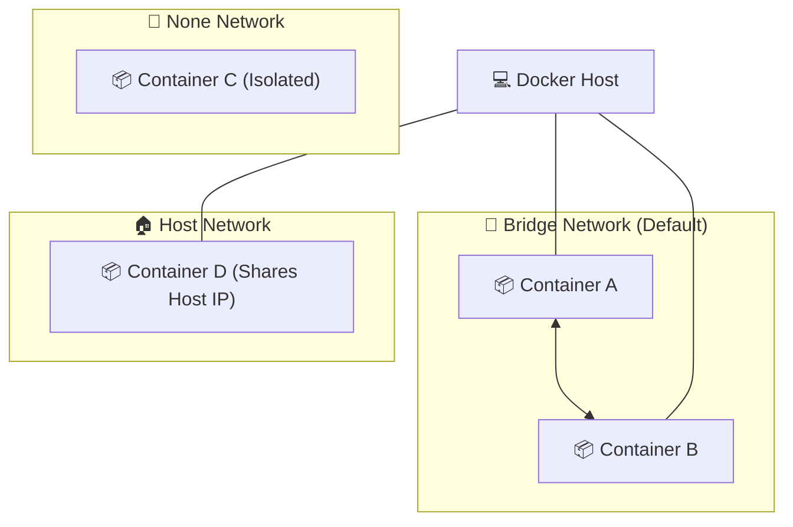

# 🐳 Docker Reference Guide

A comprehensive guide to essential Docker commands for managing containers and images efficiently.

---

## 🧱 Core Concepts

Before using commands, it's essential to understand the two main building blocks of Docker:

### 1. 🖼️ Docker Image
A **Docker Image** is a read-only template containing the instructions for creating a Docker container. Think of it as a **blueprint**, a **snapshot**, or a **class** in OOP.

- **📦 Layered Structure**: Application images are built on top of **Base Images**. You start with an OS layer and stack your application code and dependencies on top.
- **🐧 Linux Foundations**: Most containers are **Linux-based** because Linux is lightweight, open-source, and efficient for server environments.
- **🏔️ Example (Alpine)**: **Alpine Linux** is one of the most popular base images because it is incredibly small (approx. 5MB), ensuring fast downloads and minimal resource usage.

### 2. 📦 Docker Container
A **Docker Container** is a running instance of an image. It is a **live, isolated environment** where your application executes. It adds a thin writable layer on top of the read-only image.

- **📦 All-in-One Packaging**: Containers package the application code along with all its necessary dependencies, libraries, and configurations.
- **🚀 Portability**: Because everything is bundled together, containers are easily shared and moved across different environments (dev, staging, production) without "dependency hell."
- **⚡ Efficiency**: This consistency makes the entire development and deployment lifecycle significantly more streamlined and efficient.

---

### 💡 Image vs. Container Comparison

| Feature | Docker Image | Docker Container |
| :--- | :--- | :--- |
| **Analogy** | Blueprint / Class | Building / Object Instance |
| **State** | Static (Stored on disk) | Dynamic (Running in memory) |
| **Mutability** | Immutable (Read-only) | Mutable (Writable layer) |
| **Lifespan** | Persistent | Ephemeral (can be started/stopped/deleted) |

---

### 🏠 Where do they "Live"?

- **Docker Images** live in a **Registry** (like [Docker Hub](https://hub.docker.com)). You `pull` them from a registry to your local machine to use them.
- **Docker Containers** live and run on a **Docker Host**. This is your local computer or a cloud server where the **Docker Engine** is installed. Containers are isolated processes that share the host's OS kernel.

---

## 🛠️ Essential Commands

### 1. `docker version`
**Description**: Display the Docker version information, including client and server details. Use this to verify your installation and check compatibility.

**Example**:
```bash
$ docker version
Client:
 Version:           29.4.0
 API version:       1.54
 Go version:        go1.26.1
 Git commit:        9d7ad9f
 Built:             Tue Apr  7 08:39:39 2026
 OS/Arch:           windows/amd64
 Context:           desktop-linux

Server: Docker Desktop 4.69.0 (224084)
 Engine:
  Version:          29.4.0
  API version:      1.54 (minimum version 1.40)
  Go version:       go1.26.1
  Git commit:       daa0cb7
  Built:            Tue Apr  7 08:36:03 2026
  OS/Arch:          linux/amd64
  Experimental:     false
 containerd:
  Version:          v2.2.1
  GitCommit:        dea7da592f5d1d2b7755e3a161be07f43fad8f75
 runc:
  Version:          1.3.4
  GitCommit:        v1.3.4-0-gd6d73eb8
 docker-init:
  Version:          0.19.0
  GitCommit:        de40ad0
```

---

### 2. `docker images`
**Description**: List all locally stored Docker images. This command shows the repository name, tag, image ID, creation date, and size.

**Example**:
```bash
$ docker images
                                                                i Info →   U  In Use
IMAGE   ID             DISK USAGE   CONTENT SIZE   EXTRA
```

---

### 3. `docker pull`
**Description**: Download an image from a registry (typically Docker Hub) to your local machine.

**Syntax**:
```bash
docker pull [OPTIONS] NAME[:TAG|@DIGEST]
```

**Examples**:
```bash
# Pull the latest version of the official Nginx image
docker pull nginx:latest
```

```bash
$ docker pull redis
Using default tag: latest
latest: Pulling from library/redis
5435b2dcdf5c: Pull complete
edc4b8e535e8: Pull complete
0d8ecf679ede: Pull complete
e22d95bb4ed9: Pull complete
dbf833dfdfed: Pull complete
387e0421c8da: Pull complete
4f4fb700ef54: Pull complete
5eefc97b6afb: Download complete
048ce8724475: Download complete
Digest: sha256:1f073813b641755b70b0200da64131bbeeb4ec5b633ca67772229b49820caafa
Status: Downloaded newer image for redis:latest
docker.io/library/redis:latest

What's next:
    View a summary of image vulnerabilities and recommendations → docker scout quickview redis
```

---

### 4. `docker run`
**Description**: Create and start a container from an image. This command is the primary way to launch applications in Docker.

**Common Flags**:
- `-d`: Run container in the background (detached mode).
- `-p`: Publish a container's port(s) to the host (e.g., `8080:80`).
- `--name`: Assign a custom name to your container for easier management.
- `-it`: Interactive mode (interactive + TTY), useful for shell access.
- `--rm`: Automatically remove the container when it exits.
- `-e`: Set environment variables (e.g., `-e KEY=VALUE`).

**Examples**:
```bash
# Run an Nginx web server in the background on port 8080
docker run -d -p 8080:80 --name my-web-server nginx

# Run a Node.js container with a custom name
docker run --name my-node-app node

# Run a PostgreSQL database with an environment variable and port mapping
 docker run -d --name postgres_db -e POSTGRES_USER=pradipta -e POSTGRES_PASSWORD=password -e POSTGRES_DB=mydb -p 5432:5432 postgres:latest

# Run a mongo database with an environment variable with network and port mapping
  docker run -d --name mongo -p 27017:27017 -e MONGO_INITDB_ROOT_USERNAME=mongoadmin -e MONGO_INITDB_ROOT_PASSWORD=password --network mongo-network mongo:latest

# Run Node.js interactively with a custom name
docker run -it --name pradipta_node node

# Run a Redis container with a custom name
$ docker run --name pradipta_redis redis
Starting Redis Server
```

**What this command does**:
- **Finds the image**: Checks if the `node` image exists locally; if not, it pulls it from Docker Hub.
- **Creates the container**: Sets up a new container instance from the image.
- **Assigns a name**: Names the container `my-node-app` instead of using a random string.
- **Starts the process**: Executes the default entrypoint for the Node.js image.

---

### 5. `docker start`
**Description**: Start one or more stopped containers. This is used when you already have a container created (via `run` or `create`) but it is currently in a stopped state.

**Example**:
```bash
# Start a container by its name
docker start my-web-server

# Start a container by its ID
docker start 1a2b3c4d5e6f

# Start the Redis container and see its name as output
$ docker start pradipta_redis
pradipta_redis
```

---

## 💡 `docker run` vs `docker start`

Understanding the difference between these two is crucial for efficient container management:

| Feature | `docker run` | `docker start` |
| :--- | :--- | :--- |
| **Primary Action** | Creates a **NEW** container and starts it. | Restarts an **EXISTING** stopped container. |
| **Source** | Uses an **Image**. | Uses a **Container ID/Name**. |
| **Effect** | Every execution creates a fresh instance. | Resumes the state of a specific instance. |
| **Typical Use** | Initial deployment or testing. | Resuming work on a persistent container. |

> [!IMPORTANT]
> Use `docker run` when you want a new container. Use `docker start` when you want to bring an old container back to life.

### 💡 Execution Behavior
- **`docker run -d`**: Creates + starts a container in the **background**.
- **`docker start`**: Just starts an already created container. 
  - 👉 **Note**: By default, `docker start` always runs in the **background**.

---

> [!TIP]
> You can combine flags for more powerful queries, such as `docker ps -aq` to get only the IDs of all containers.

---

### 6. `docker attach`
**Description**: Attach your local standard input, output, and error streams to a running container. This allows you to view its output or interact with it in real-time.

> [!IMPORTANT]
> `docker attach` always takes you to the **primary command** (PID 1) of the container.

**Example**:
```bash
# Attach to a generic web server
docker attach my-web-server

# Attach to Redis and view shutdown logs after pressing Ctrl+C
$ docker attach pradipta_redis
1:signal-handler (1776784417) Received SIGINT scheduling shutdown...
1:M 21 Apr 2026 15:13:37.247 * User requested shutdown...
1:M 21 Apr 2026 15:13:37.250 * Saving the final RDB snapshot before exiting.
1:M 21 Apr 2026 15:13:37.258 * BGSAVE done, 0 keys saved, 0 keys skipped, 88 bytes written.
1:M 21 Apr 2026 15:13:37.271 * DB saved on disk
1:M 21 Apr 2026 15:13:37.271 # Redis is now ready to exit, bye bye...

got 3 SIGTERM/SIGINTs, forcefully exiting
```

> [!NOTE]
> When you attach to a process like Redis, the terminal may appear blank if the process isn't currently outputting anything. Pressing `Ctrl+C` will send a SIGINT signal, which typically stops the process and shuts down the container, as shown in the logs above.

> [!TIP]
> To detach from a container without stopping it, use the escape sequence `Ctrl+P`, `Ctrl+Q`.

---

### 7. `docker exec`
**Description**: Run a new command in a **running** container. This is most commonly used to open an interactive shell inside a container.

**Example**:
```bash
# Open an interactive bash shell inside a running container
docker exec -it my-web-server /bin/bash

# Run a single command (like 'ls') inside a container
docker exec my-web-server ls /etc/nginx

# Open the Redis CLI interactively inside a running Redis container
$ docker exec -it pradipta_redis redis-cli
127.0.0.1:6379> ping
PONG
127.0.0.1:6379>
```

---

### 8. `docker stop`
**Description**: Stop one or more running containers. This sends a SIGTERM signal to the container's primary process.

**Example**:
```bash
# Stop a container by its name
docker stop pradipta_redis

# Stop multiple containers
docker stop container1 container2

# Terminal output (confirms by echoing the name)
$ docker stop pradipta_redis
pradipta_redis
```

---

### 9. `docker rm`
**Description**: Remove one or more containers. The container must be stopped before it can be removed unless you use the `-f` (force) flag.

**Example**:
```bash
# Remove a stopped container
docker rm pradipta_redis

# Forcefully remove a running container
docker rm -f pradipta_redis

# Terminal output (confirms by echoing the name)
$ docker rm pradipta_redis
pradipta_redis
```

> [!CAUTION]
> If you try to remove a **running** container without the `-f` flag, Docker will throw an error:
> ```text
> Error response from daemon: cannot remove container "pradipta_redis": container is running: stop the container before removing or force remove
> ```

---

### 10. `docker ps`
**Description**: List running containers. Use the `-a` flag to see all containers (including stopped ones).

**Example**:
```bash
# List only running containers
docker ps

# List all containers (running and stopped)
docker ps -a

# View detailed information about running containers
$ docker ps
CONTAINER ID   IMAGE     COMMAND                  CREATED         STATUS         PORTS      NAMES
8698d0e806ac   redis     "docker-entrypoint.s…"   4 minutes ago   Up 2 minutes   6379/tcp   pradipta_redis
```

---

### 11. `docker logs`
**Description**: Fetch the logs of a container. This is essential for debugging applications running in detached mode or to see historical output.

**Common Flags**:
- `-f`: Follow log output (real-time streaming).
- `--tail`: Show only the last `N` lines of logs (e.g., `--tail 10`).
- `-t`: Show timestamps in the log output.

**Example**:
```bash
# View the last 20 lines of logs for the Postgres database
docker logs --tail 20 postgres_db

# Follow the logs of a web server in real-time
docker logs -f my-web-server
```

---

### 12. `docker network ls`
**Description**: List all the networks that Docker is aware of on the host. This includes built-in networks like `bridge`, `host`, and `none`.

**Example**:
```bash
$ docker network ls
NETWORK ID     NAME      DRIVER    SCOPE
f9ca1d16e3dc   bridge    bridge    local
dac43f28d82b   host      host      local
65a0817ffe24   none      null      local
```

### 🧠 Understanding Network Columns

| Column | Description | Significance |
| :--- | :--- | :--- |
| **NAME** | The display name of the network. | Used to identify the network when connecting containers (e.g., `docker run --network <NAME>`). |
| **DRIVER** | The engine that manages the network. | Determines the networking behavior (Isolation, routing, multi-host connectivity). |
| **SCOPE** | The reach of the network. | `local` means it's confined to a single host; `swarm` means it spans multiple hosts. |

#### 🛠️ Common Network Drivers
- **bridge**: The default driver. Containers on the same bridge can talk to each other but are isolated from the host's physical network.
- **host**: Removes network isolation. The container uses the host's IP and ports directly.
- **none**: Complete isolation. The container has no network access.
- **overlay**: Connects multiple Docker daemons together, allowing containers to communicate across different physical machines.

### 📊 Network Isolation Visualization



---

### 13. `docker network create`
**Description**: Create a new network for your containers. By default, it creates a `bridge` network. Custom networks allow containers to communicate with each other using their container names as hostnames (Automatic DNS resolution).

**Example**:
```bash
# Create a custom bridge network named 'mongo-network'
$ docker network create mongo-network
f4cb73665d586d8ef26038bf80f65e01b8a7435918617a5b18231145aacb90e5
```

---
ontainer D (Shares Host IP)"]
    end
    Host --- C1
    Host --- C2
    Host --- C4
```

---